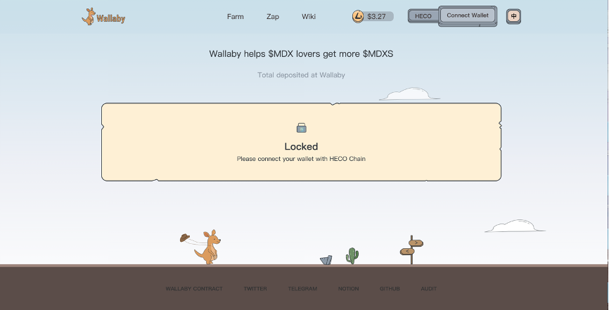
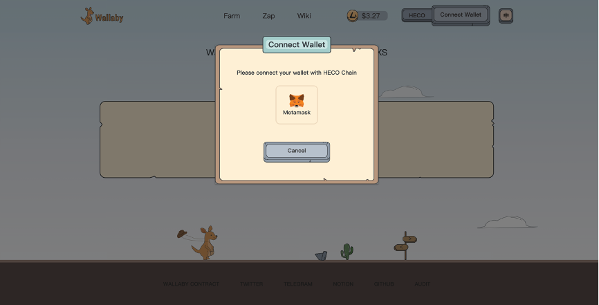
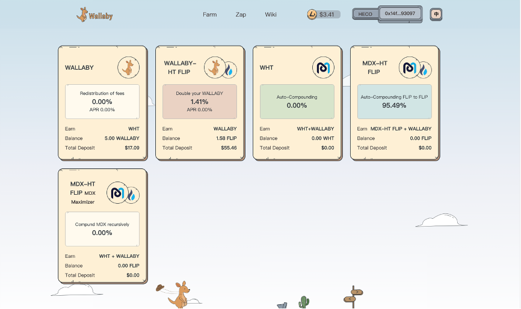
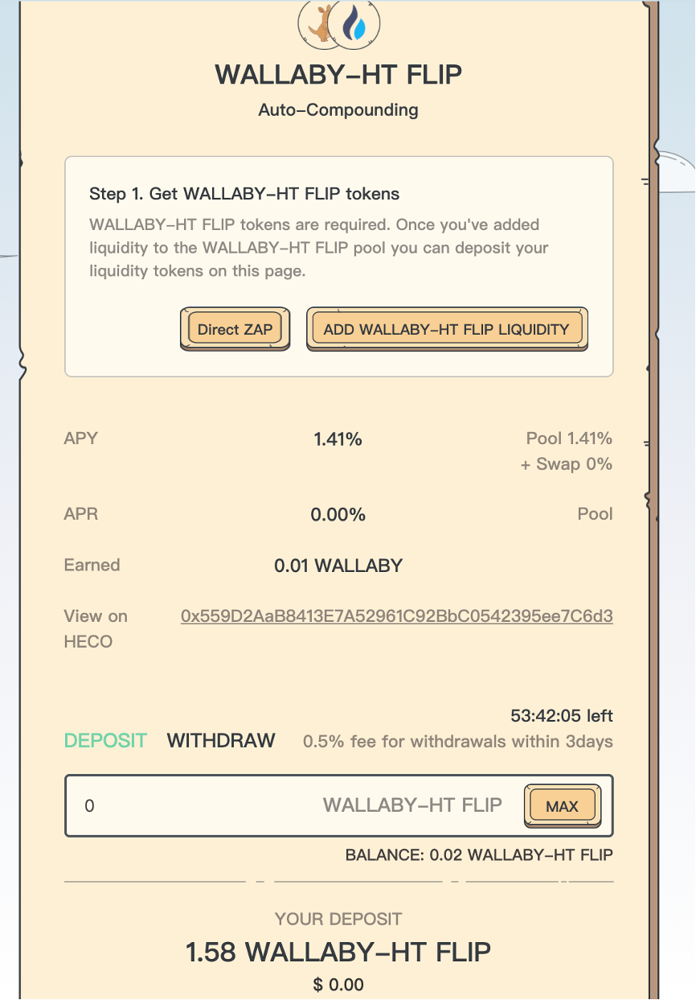
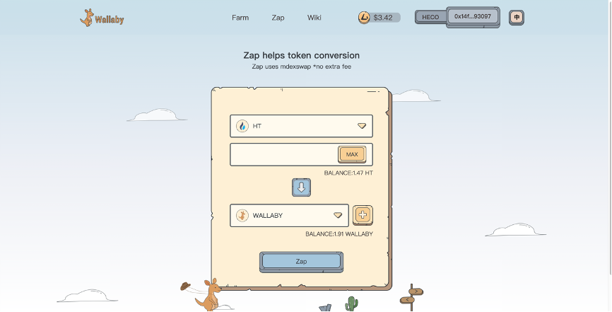
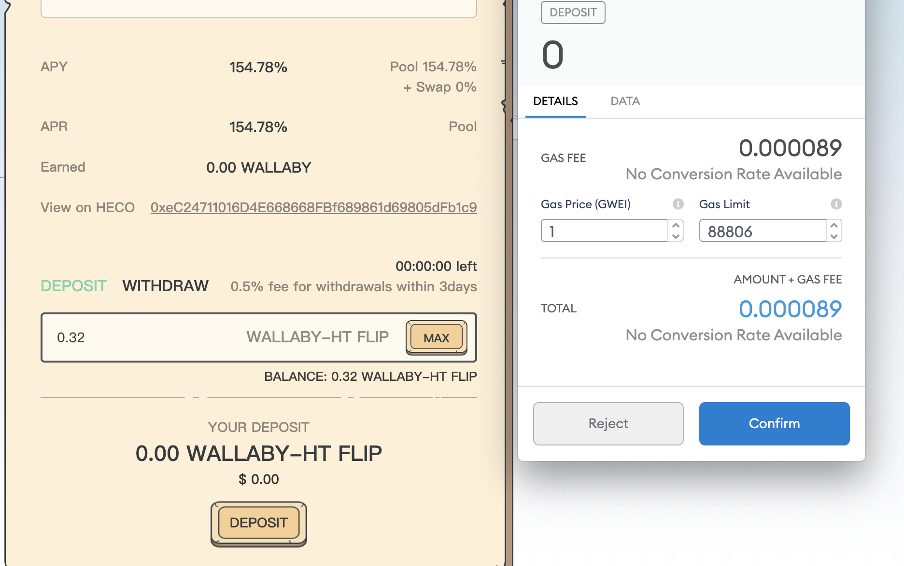

Prerequisites
=============

You must have a specific Farm’s underlying token. For MDX-WHT, you need MDX tokens and WHT tokens. The same for other respective farms.

You must have a supported wallet, either metamask, Trust Wallet !

Walkthrough
===========
Go to Wallaby.finance/ and click “Connect Wallet”

Click either the Metamask  depending on what you use

Select the Farm you want to invest in

You need LP Tokens (LP Tokens) (MDX-WHT LP, MDX-USDT LP, etc)

You can also use our Zap feature to provide LP tokens with just one click.

After receiving LP Tokens, enter the amount of tokens you want to deposit and click “Deposit”

Confirm the transaction with Metamask or WalletConnect

View the transaction on HecoInfo and await the confirmation

Congrats! You have now joined the WallabyFarm!

